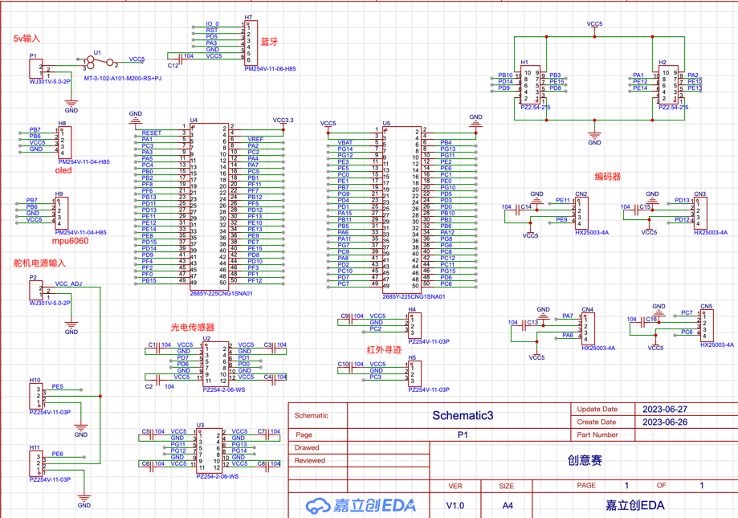

# <div style='color:pink'>爱坤战队!</div>
## 主控芯片：stm32F407ZGxx


## 原理图


## openocd.cfg配置
### JLINK
```jlink
source [find interface/jlink.cfg]
transport select swd
source [find target/stm32f4x.cfg]
adapter speed 100000
```
### ST-LINK
```stlink
source [find interface/stlink.cfg]
transport select hla_swd
source [find target/stm32f4x.cfg]
adapter speed 100000
```
### CMSIS-DAP
```stlink
source [find interface/cmsis-dap.cfg]
transport select swd
source [find target/stm32f4x.cfg]
adapter speed 100000
```

## 项目架构
```angular2html
            Main()
              |
              | 
              | -------编码器和电机处理任务
                -------传感器处理任务
                -------Debug任务
                -------串口接受和处理任务
```